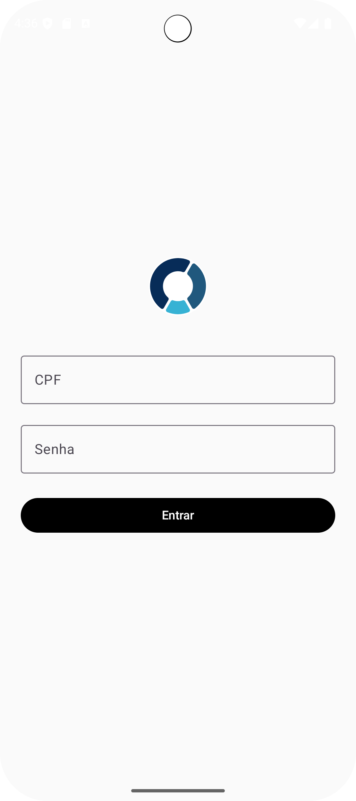
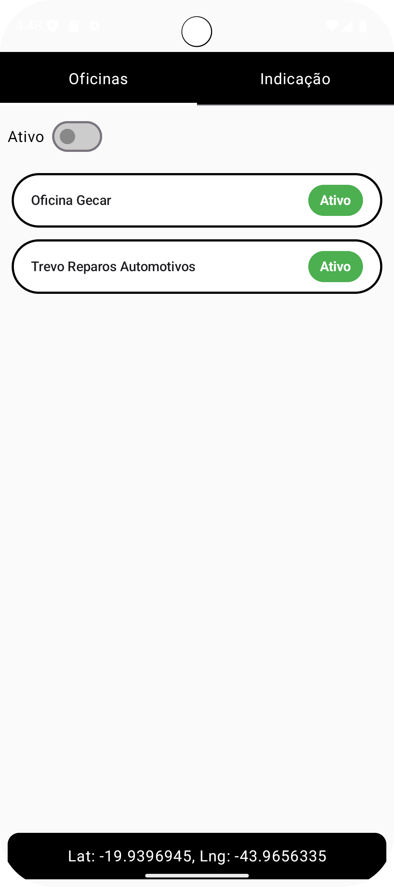
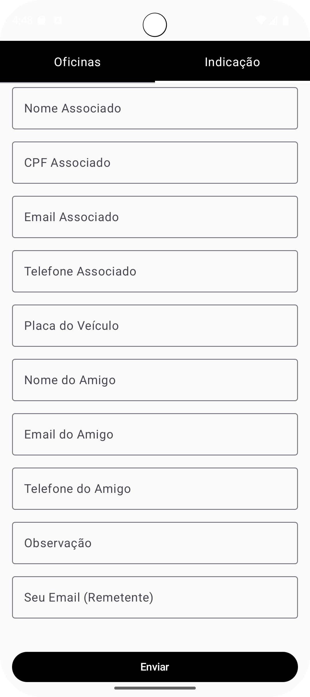

# Hinova Oficinas – Android Technical Test

## Overview

This project is a **native Android application** developed as part of the technical assessment for the Android and iOS Mobile Developer position at HSD Mobile. The application demonstrates proficiency in **Android development**, modern **architecture patterns**, and best practices.

The app is built using:

- **MVVM (Model-View-ViewModel)** architecture
- **Jetpack Compose** for modern declarative UI
- **Material 3** for design components
- **Kotlin** as the primary programming language
- **DataStore** for secure local storage of user data
- **Coroutines & Flow** for asynchronous programming and state management
- **Retrofit** for API consumption (mocked and real endpoints)

The application covers login functionality, session management, list display, filtering, and user interactions with tabs and details screens.

---

## Screenshots






## Features

### 1. Login Screen (`ActivityLogin`)

- Users can input **CPF** and **password**.
- 
- **Session persistence**: After successful login, user data is stored in DataStore, enabling automatic login on subsequent app launches.

### 2. Main Screen (`ActivityPrincipal`)

The main screen uses a **TabLayout** (Jetpack Compose `TabRow`) with two tabs:

#### A) Tab "Oficinas"

- Displays a list of workshops (Oficinas) retrieved from the API.
- Allows filtering by status ("Active" only or all).
- Clicking a workshop item navigates to the Workshop Details Screen.
- **Mandatory feature**: The device's current location is requested and displayed at the bottom of this screen (latitude & longitude).

#### B) Tab "Indicação"

- Provides a clean UI for inviting friends.
- Includes a form to submit invitation data to the API (as per documentation).

### 3. Workshop Details Screen (`ActivityDetalhesOficina`)

Displays detailed information about the selected workshop.

**Mandatory feature**:

- A "QR Code Reader" button that requests camera access. Opening the camera is required; capturing or processing the photo is not necessary.

---

## Architecture & Best Practices

### MVVM Pattern:

- **ViewModel** handles state and business logic
- **Repository** handles data operations (API calls & local storage)
- **View** (Compose screens) observes state changes via StateFlow / LiveData

### Jetpack Compose:

- All UI implemented using Compose components for modern declarative UI
- Material 3 theming for consistent design

### Data Storage & Session Management:

- **DataStore** is used to securely persist user session
- On app restart, the login state is automatically restored

### Networking:

- **Retrofit + OkHttp** for API communication

### Location:

- Integrated **FusedLocationProviderClient** to get device location
- Location displayed in the main screen footer

### Permissions:

- Runtime permission handling for **Camera** and **Location**

---

## How to Run

1. Clone the repository:
```bash
git clone https://github.com/username/hinova-oficinas.git
```

2. Open the project in **Android Studio**

3. Build and run the application on an emulator or physical device

4. Login using any valid CPF format and a password of at least 8 characters

---

## Notes

- Focused on **clean code** and **modular architecture** for maintainability
- UI designed for ease of use and visual appeal
- Jetpack Compose ensures a modern, scalable design
- All mandatory features, including location display and camera access, are implemented

---

## Technologies Used

- Kotlin
- Jetpack Compose
- Material 3
- MVVM Architecture
- Retrofit / OkHttp
- DataStore
- Coroutines & Flow
- FusedLocationProviderClient